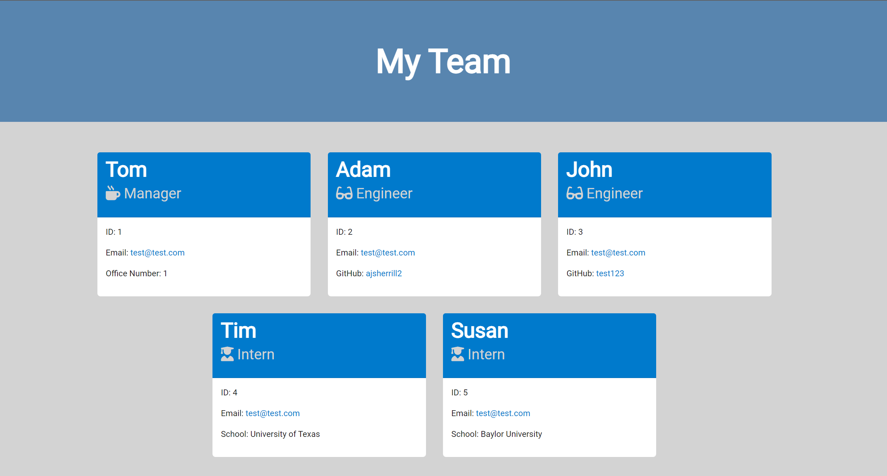

# Team-Profile-Generator

## Description

In this Project I was tasked with creating a team profile generator using node.js object oriented programming and Javascript. This generator takes in a users inputs for a manager and their choice of either engineer and/or intern in the terminal command line and pastes given inputs to a HTML template in order to simplify and speed up the profile building process for each given employee.

## Table of Contents

- [Installation](#installation)
- [Usage](#usage)
- [Credits](#credits)
- [License](#license)
- [Badges](#Badges)
- [Features](#Features)
- [Tests](#Tests)
- [Questions](#Questions)

## Installation

To Install:

Install node.js lts

Clone the repository from GitHub (https://github.com/ajsherrill2/Team-Profile-Generator).

Run these command lines in your terminal to install necessary dependencies:

```
npm init -y
npm install
```

Run this command line in your terminal to install inquirer:

```
npm i inquirer@8.2.4
```

## Usage

Direct your terminal to the /Develop directory and run this command line to initiate application:

```
node index.js
```

Watch this short video demonstration [here](https://drive.google.com/file/d/1HybpWxdy7Wpw7kNA7DQBvl4XK7kn-FFk/view)



Image of generated team profile

## Credits

Collaborators:

Salissa Hernandez - https://github.com/Salissa4

Shawn Tschoepe - https://github.com/shawn220a

## License

This application is covered under the MIT license.

## Badges


## Features

One feature you will find in this application is when the user selects 'none' for the license prompt, the license section will be removed from the readme all together.

## Tests

You can access test cases by directing yourself to the _tests_ directory in your terminal and running these command lines:

```
npm i jest
npm run test
```

## Questions

If you have any questions about the repo open an issue or contact me directly at adamsherrill2@gmail.com. You can find more of my work at [ajsherrill2](https://github.com/ajsherrill2/).
